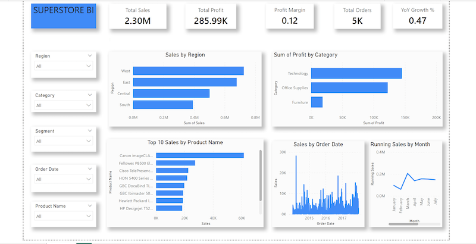
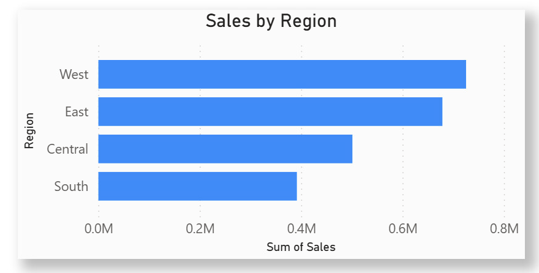
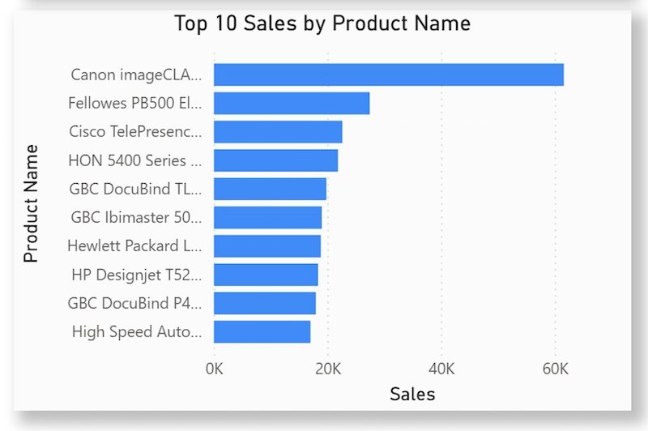
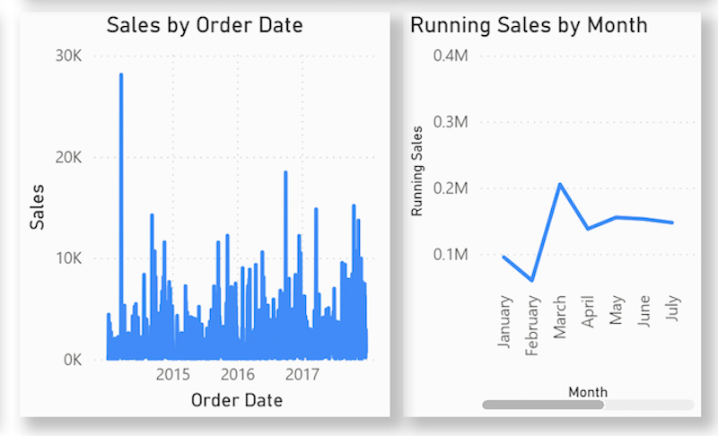

# Retail-_SuperStore_PBI_Dashboard
Retail sales analytics dashboard built with Power BI, Power Query, and DAX featuring YoY growth and KPI analysis.

# Retail Sales Analytics Dashboard (Power BI + Power Query + DAX)

## Overview
This project is an end-to-end data analytics solution built in Power BI. It transforms a raw, semi-structured CSV dataset into a clean analytical model and interactive business intelligence dashboard.

The goal is to analyze retail performance across regions, products, and time, while demonstrating data cleaning, modeling, and advanced DAX capabilities.

---

## Tech Stack
- Power BI (Data Visualization)
- Power Query (ETL / Data Cleaning)
- DAX (Measures & Time Intelligence)

---

##  Key Features

### Data Engineering (Power Query)
- Fixed misaligned CSV structure with column-level reconciliation logic
- Implemented null-fallback transformation strategy across multiple fields
- Standardized schema and corrected data types (dates, numeric fields, text fields)

### Data Modeling
- Built a structured analytical model from raw transactional data
- Created a star-schema style dataset for reporting
- Optimized relationships for time-based analysis

### DAX Measures
- Total Sales
- Total Profit
- Profit Margin
- Running Total (Sales & Profit)
- Year-over-Year (YoY) Growth %

### Dashboard Features
- KPI Cards (Sales, Profit, Margin, Orders)
- Sales by Region
- Top 10 Products by Sales
- Sales vs Profit Scatter Analysis
- Time Series Trend (Monthly Sales)
- Interactive slicers (Region, Category, Segment, Date)

---

## Key Insights
- Regional performance differences highlight uneven revenue distribution
- High sales do not always translate into high profit : Some categories (often Furniture) have high sales but low or negative profit
- Profit is unevenly distributed across regions :West → strong profit ; South → weaker margins ;Some regions may even lose money in specific categories
- Year to Year sales growth shows clear seasonality, with a peak around 2015 when the business first opened, but subsequent years were unable to surpass that initial high point.
 

## Dashboard Preview

### 🟦 Overview Dashboard

### 🟦 Sales by Region

### 🟦 Top Products

### 🟦 Time Series Analysis

---

## 📁 Project Structure
  /PowerBI
      └── retail-dashboard.pbix
  /images
      ├── dashboard-overview.png
      ├── region-analysis.png
      ├── top-products.png
      └── trend-analysis.png

---

## How to Use
1. Download the `PP1 - Superstore POWER BI.pbix` file
2. Optional (Open the `PP1 - Superstore.xlsx` file
3. Open in Power BI Desktop
4. Refresh data if needed
5. Explore dashboard using filters and slicers
   

---

## Skills Demonstrated
- Data Cleaning & Transformation (Power Query)
- Data Modeling
- DAX (Advanced Measures)
- Time Intelligence Analysis
- Business Insight Generation
- Dashboard Design

---

## Author : Kouabenan Jaures Adoua 
Built as part of a Business Technology Management (BTM) data analytics portfolio focusing on real-world BI workflows.

